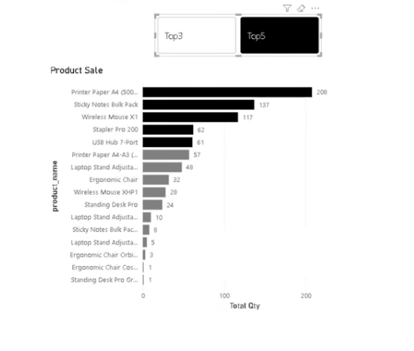

## How to create a dynamic slicer:


([YT video](https://www.youtube.com/watch?v=8nSuExlXm48&list=PLS9G9TidSErwfNpiBu6osvDg0H1cIzR0p&index=2))
## Power BI Top N Bar Chart: Interactive Slicer
How can you make a Power BI bar chart instantly highlight your best-performing products?

In my latest short video, I demonstrate an interactive Top N product chart using a slicer. Selecting Top 3, Top 5, or Top 7 dynamically changes which products are highlighted based on total quantity sold.

I created a parameter-driven slicer and used three DAX measures:

Total Qty to calculate total quantity sold

Product Rank using RANKX to rank each product

Colour to apply conditional formatting: selected Top N products appear in black, while the remaining products appear in grey

This is a simple but effective way to make reports more interactive and help users focus on the products that matter most.

What other Power BI visuals would you enhance with a dynamic Top N selector?

#PowerBI #DAX #DataAnalysis #PowerBITutorial #DataVisualization #BusinessIntelligence #MarketingAnalytics #DataTips #PowerBIForBeginners #DashboardDesign #DataStorytelling
#DataManagement #IT #TechSkills #DataSkills #Organisation #Beginner #LearningByDoing #Shorts #Efficiency


1. Create the parameter as a numeric range: Parameter

2. Add a column to a table:
``` dax
ParName = "Top" & TopN'[TopN]
```


3. Create a Measures:
``` dax
Total Qty = SUM(sales_data_cleaned[quantity])
```
```dax
Product Rank = 
RANKX(
    all('sales_data_cleaned'[product_name]), [Total Qty], 
    ,DESC)
```
```dax
Colour = VAR SelectedTopN = SELECTEDVALUE('TopN'[TopN])
RETURN
IF([Product Rank]<= SelectedTopN, "#000000", "#808080")
```

4. Use the colour measure in a bar chart for conditional formatting
