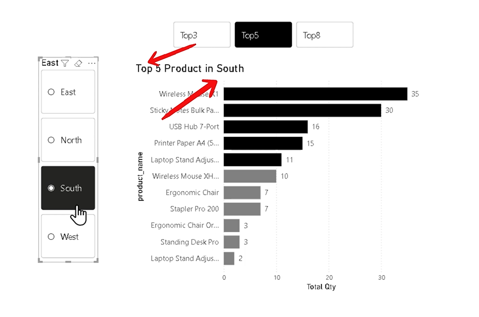
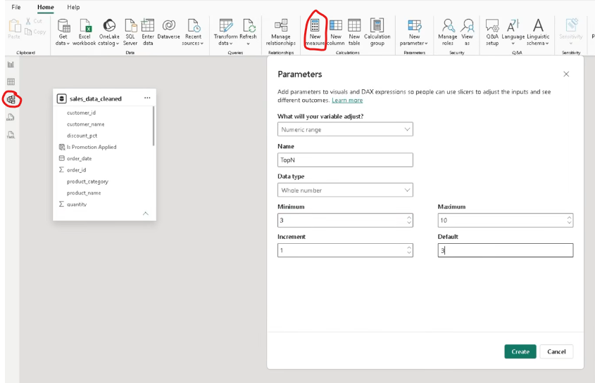
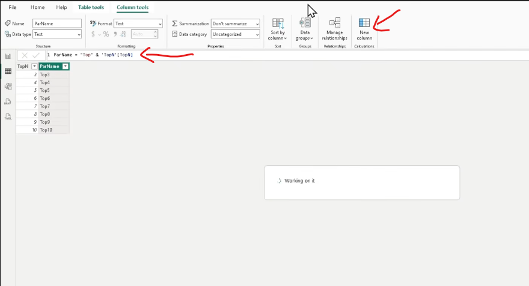
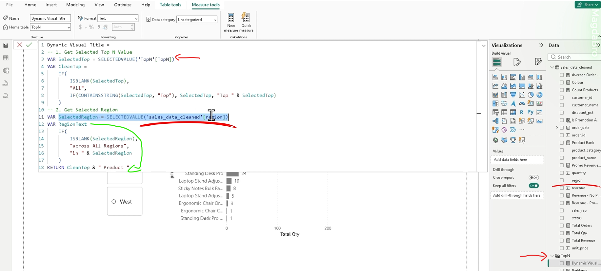

## How to create dynamic title:


YouTube : ([video](https://www.youtube.com/watch?v=bK9jUUKHe_k))

### Power BI Dynamic Chart Titles
A chart title should tell the story behind the data - especially when users change slicer selections.

In my latest short Power BI video, I show how to create a dynamic visual title that updates automatically based on the selected Top N value and region.

For example, the title can change to:

Top 3 Products in North

Top 5 Products across All Regions

All Products in South

I used SELECTEDVALUE, IF, and CONTAINSSTRING in DAX to capture slicer selections, handle blank values, and return a clear, user-friendly title.

The video showing how I created the parameter and dynamic Top N slicer is available here:

Do you use dynamic titles in your Power BI reports, or do you still rely on static chart headings?

#PowerBI #DAX #DataVisualisation #BusinessIntelligence #PowerBICommunity #DataAnalytics #DashboardDesign #DataStorytelling #MicrosoftFabric

1. Create the parameter as a numeric range:


2. Add a column to a table:
``` dax
ParName = "Top" & TopN'[TopN]
```



4. Create a Measure:


``` dax
Dynamic Visual Title = 
-- 1. Get Selected Top N Value
VAR SelectedTop = SELECTEDVALUE('TopN'[TopN])
VAR CleanTop = 
    IF(
        ISBLANK(SelectedTop), 
        "All", 
        IF(CONTAINSSTRING(SelectedTop, "Top"), SelectedTop, "Top " & SelectedTop)
    )
-- 2. Get Selected Region
VAR SelectedRegion = SELECTEDVALUE('sales_data_cleaned'[region])
VAR RegionText = 
    IF(
        ISBLANK(SelectedRegion), 
        "across All Regions", 
        "in " & SelectedRegion
    )
RETURN CleanTop & " Product " & RegionText

```
