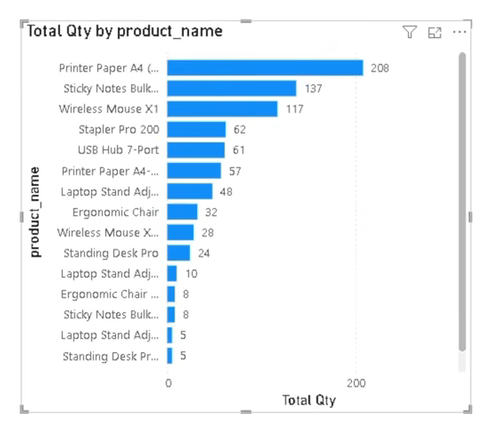
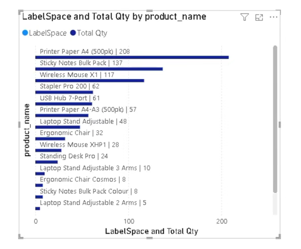

# Power BI Trick: Display Full Product Names Above Bars Instead of Truncated Y-Axis Labels
([YT video](https://www.youtube.com/watch?v=KThSBGZ0bso))

When working with horizontal bar charts in Power BI, product names can be too long to fit on the Y-axis.

As a result:

- Product names get truncated with "..."
- Labels can become difficult to read
- Important information is hidden from users
- Chart readability decreases

### Before



In the example above, several product names are cut off, making it difficult to identify products quickly.

Examples:

- Printer Paper A4 (...)
- Sticky Notes Bulk...
- Wireless Mouse X...
- Laptop Stand Adj...

---

## The Solution

Instead of displaying product names on the Y-axis, we can create custom labels above each bar.

This approach displays:

- Full Product Name
- Total Quantity
- Cleaner visual appearance
- Better user experience

### After



Now users can immediately see:

```
Printer Paper A4 (500pk) | 208
Sticky Notes Bulk Pack | 137
Wireless Mouse X1 | 117
```

without any truncation.

---

# Step 1: Create a Label Measure

This measure combines the Product Name and Total Quantity.

```DAX
LabelProduct =
VAR ProdName =
    SELECTEDVALUE(sales_data_cleaned[product_name])

VAR TotQty =
    [Total Qty]

VAR Print =
    ProdName & " | " & TotQty

RETURN
    Print
```

### Example Output

```text
Printer Paper A4 (500pk) | 208
Sticky Notes Bulk Pack | 137
Wireless Mouse X1 | 117
```

---

# Step 2: Create a Placeholder Measure

Create a measure that always returns zero.

```DAX
LabelSpace = 0
```

This measure acts as a positioning helper for the labels.

---

# Step 3: Build the Visual

1. Insert a **Clustered Bar Chart**
2. Add:

### Y-Axis

```text
product_name
```

### Values

```text
LabelSpace
Total Qty
```

Your chart should now contain:

- LabelSpace
- Total Qty

as separate series.

---

# Step 4: Configure Data Labels

For the **LabelSpace** series:

- Turn Data Labels ON
- Select "Field Value"
- Use the measure:

```DAX
LabelProduct
```

Position:

```text
Outside End
```

The label will now appear above the bar.

---

# Result

✅ Full product names displayed

✅ No truncation

✅ Quantity shown together with product name

✅ Better readability

✅ Improved data storytelling

---

# Why This Works

The Y-axis in Power BI has limited space for long text values.

By moving labels into a dedicated measure and displaying them through a placeholder series, we gain complete control over what is shown on the chart.

This technique is especially useful for:

- Product Analysis
- Sales Dashboards
- Inventory Reports
- Category Performance Analysis
- Executive KPI Dashboards

---


---

### DAX Used

```DAX
LabelProduct =
VAR ProdName =
    SELECTEDVALUE(sales_data_cleaned[product_name])
VAR TotQty =
    [Total Qty]
VAR Print =
    ProdName & " | " & TotQty
RETURN
    Print
```

```DAX
LabelSpace = 0
```

#PowerBI #DAX #DataVisualization #BusinessIntelligence #Analytics #MicrosoftFabric #PowerBITips #DashboardDesign #DataStorytelling #DataAnalytics
